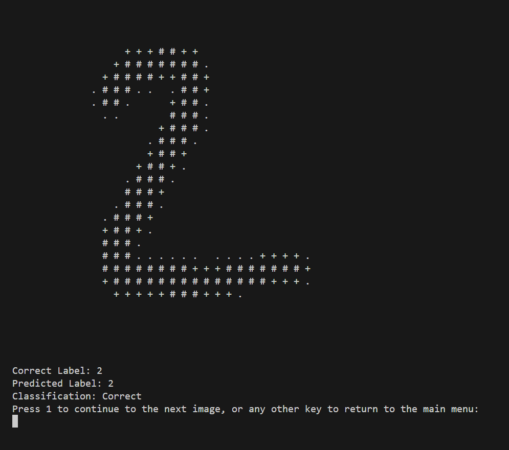
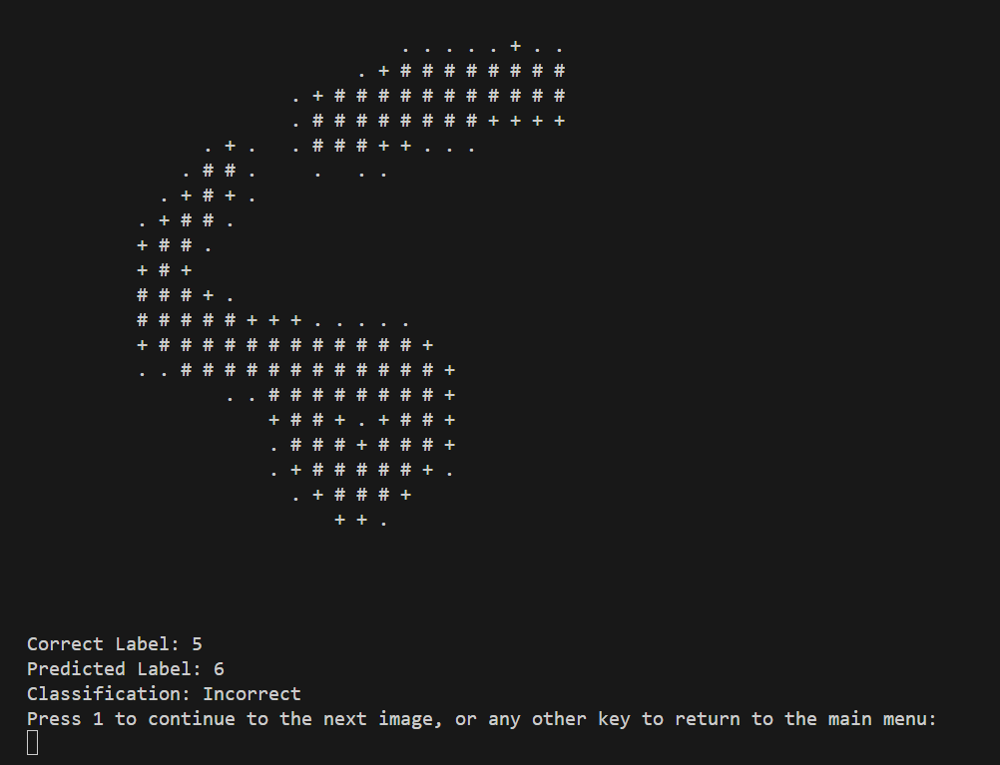

# Neural_Network
This is a ai that is made in java that can recognize the numbers 1-9

Enter a valid number 1-8 as a command:
1 - Train the network (trains a csv filled with greyscale data)
2 - Load pre-trained network (loads in pretrained weights and biases if they are there have to use option 7 to save)
3 - Display network accuracy on training data (shows stats about the ai accuracy)
4 - Display network accuracy on testing data (uses a smaller testing set csv to show ai accuracy)
5 - Run network on testing data showing images and labels (gives a visual representation of the data that is being read)
6 - Display the misclassified testing images (gives a visual representation to the miscalssified data)
7 - Save the network state to file (saves weigths / biases to a csv)
8 - Exit

Example of option 5: 

Example of options 6: 
